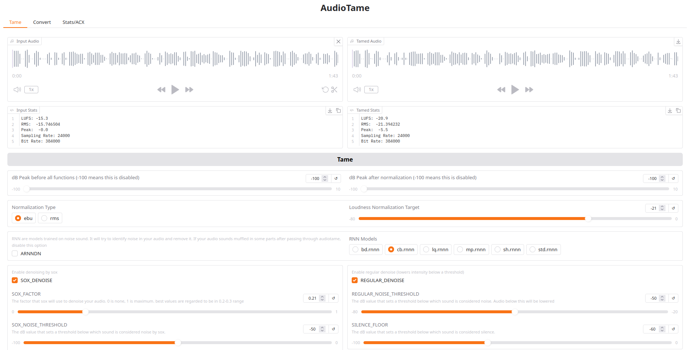

# AudioTame

A command-line tool that normalizes audio and reduces noise. This tool aims to effortless create an audio file that is high in quality. It targets an integrated loudness (LUFS, RMS) close to 20, by default. It uses [ffmpeg-normalize](https://github.com/slhck/ffmpeg-normalize) and additional ffmpeg filters to achieve the desired result, as well as SoX and mp3gain.

Audiotame has an [ACX Check](#acx-check). Notice, however, that while meeting these requirements may be desirable for some users, it not guaranteed to be achieved on the first run without some tweaks.

Also, it uses Bash, so it is not expected to work on Windows systems, unless used under WSL or containers.

A live demo is running on [HuggingFace](https://huggingface.co/spaces/veralvx/audiotame)

**Contents**

- [Installation](#installation)
    - [System Packages](#system-packages)
    - [Pip](#pip-package)
    - [Docker/Podman](#dockerpodman-image)
        - [Build from Source](#build-the-image-from-source)
        - [Pull the Image](#pull-the-image)
- [Usage](#usage)
    - [CLI](#cli)
        - [Tame Audio](#tame-audio)
        - [ACX Check](#acx-check)
        - [Environment File](#environment-file)
    - [Gradio](#gradio)


## Installation

### System Packages

- `ffmpeg`
- `sox`
- `mp3gain`
- `python3`
- `python3-pip`


### Pip Package

```
python3 -m pip install audiotame
```

If you wish to use this program with Gradio's Web UI:

```
python3 -m pip install audiotame[gui]
```

Notice: even installing the `pip` package, you still need to install system packages.


### Docker/Podman Image

#### Build the Image from Source

```
git clone --recurse-submodules https://github.com/veralvx/audiotame.git audiotame
cd audiotame
podman build . -t audiotame
```

#### Pull the Image

```
podman pull ghcr.io/veralvx/audiotame:cli
```

```
podman pull ghcr.io/veralvx/audiotame:gradio
```

Then, you can run:

```
podman run --rm -it --volume "$(pwd)":/workspace audiotame:cli
```

```
podman run -it -p 7860:7860 audiotame:gradio
```

#### Using Alias

Use an alias in your `~/.bashrc`:

```
alias audiotame='podman run --rm --volume $(pwd):/workspace audiotame:cli'
```

```
alias audiotame:gradio='podman run -it --rm -p 7860:7860 audiotame:gradio'
```


```
echo "alias audiotame='podman run --rm --volume \$(pwd):/workspace audiotame:cli'" >> ~/.bashrc
```

```
echo "alias audiotame:gradio='podman run -it --rm -p 7860:7860 audiotame:gradio'" >> ~/.bashrc
```

Then,

```
source ~/.bashrc
```

The directory from wich you run `audiotame` command will be mounted in `/workspace`, which is also the working directory. So, a file named `audio.wav` in your current directory can be passed to the program with:

```
audiotame audio.wav
```

## Usage:

### CLI

#### Tame Audio


```
Usage: audiotame {path_to_file | --gradio} [operation] [operation_arg]

Flag:
  --gradio                Start Gradio server

Operations:
  pass                    Do not alter peak level db
  stats                   Display audio file statistics
  acx                     Check for ACX compatibility
  sr <sample_rate>        Change sample rate (e.g., 44100)
  br <bitrate>            Change bitrate (e.g., 128k, 320k)
  convert <format>        Convert to specified format (e.g., mp3, wav)
  extract                 Extract audio from video
```


Example:

```
audiotame path_to_file
```

This outputs `file-tamed.wav` in the same directory as the file is located.


**Notice**: The functions below - [change peak level](#change-peak-level), [change sample rate](#change-sampling-rate), [change bit rate](#change-bit-rate) - may not work with all file formats. Changing peak level and sampling rate always work for `.wav` files, but that not may be the case for other file formats. Also, except for changing the peak level, the other functions are standalone, that is, they are not run inside the main function of the program

##### Change peak level

Set the db limit for the audio. For example, to tweak to -5.0 before normalization and to -3.0 after normalization:


```
audiotame path_to_file -5.0 -3.0
```

If you wish to tweak the peak only after the normalization:

```
audiotame path_to_file pass -3.0
```

##### Change Sampling Rate

```
audiotame path_to_file sr num
```

Example:

Change the sampling rate of `audio.wav` to 44.1khz

```
audiotame audio.wav sr 44100
```

##### Convert

```
audiotame path_to_file convert file_extension
```

Example:


```
audiotame audio.wav convert mp3
```

##### Extract Audio

```
audiotame path_to_file convert extract
```


Example:


```
audiotame vid.mp4 extract
```


##### Change Bit Rate

```
audiotame path_to_file br numk
```

Example:

Change the sampling rate of `audio.wav` to 192kbps

```
audiotame audio.wav br 192k
```


##### Stats

Check stats of an audio:

```
audiotame path_to_file stats
```


##### ACX Check

`acx` can be passed as the second argument to verify if an audio complies with [ACX's requirements](https://help.acx.com/s/article/what-are-the-acx-audio-submission-requirements):


```
audiotame path_to_file acx
```


| **Parameter**           | **Requirement**         |
|-------------------------|-------------------------|
| Integrated Loudness     | –23 dB to –18 dB        |
| Peak Level              | ≤ –3 dB                 |
| Bit Rate                | ≥ 192 kbps (CBR)        |
| Sample Rate             | 44.1 kHz                |


##### Environment File

This program uses some variables as default:

```
CONVERT_LOSSY_TO_WAV=1
DB_PEAK_BEFORE_ALL="-100"
DB_PEAK_AFTER_NORM="-100"
NORM_TYPE="ebu"
LOUD_TARGET="-21"
ARNNDN=0
ARNNDN_MODEL="cb.rnnn"
SOX_DENOISE=1
SOX_FACTOR=0.21
SOX_NOISE_THRESHOLD="-50"
SOX_NOISE_MIN_DURATION=0.5
REGULAR_DENOISE=1
REGULAR_NOISE_THRESHOLD="-50"
SILENCE_FLOOR="-60"
DEBUG=0
```

- `CONVERT_LOSSY_TO_WAV`: if the input format is a lossy format, the program will convert to `.wav`;

- `NORM_TYPE`: Normalization type: `ebu` ou `rms`;

- `LOUD_TARGET`: Normalization loudness target;

- `ARNNDN`: whether to use RNN (ffmpeg's arnndn filter). Must be `0` or `1`;

- `SOX_DENOISE`: whether to denoise (except for arnndn, which is a separete category) the audio or not with sox. Must be `0` or `1`. If `0`;

- `SOX_FACTOR`: the factor that sox will use to denoise your audio. 0 is none, 1 is maximum. best values are regarded to be in 0.2-0.3 range;

- `SOX_NOISE_THRESHOLD`: the dB value that sets a threshold below which sound is considered noise by sox;

- `SOX_NOISE_MIN_DURATION`: the minimum duration that a sound that is below the threshold to be considered noise by sox. The default is 0.5s;

- `REGULAR_DENOISE`: whether to denoise using ffmpeg's regular filter (lowers intensity of audio below the threshold);

- `REGULAR_NOISE_THRESHOLD`: he dB value that sets a threshold below which sound is considered noise by ffmpeg;

- `SILENCE_FLOOR`: the dB value that sets a threshold below which sound is considered silence.

- `DEBUG`: will print to the console stats of audio files generated at each step.

`NORM_TYPE` and `LOUD_TARGET` are set in accordance to [ffmpeg-normalize](https://github.com/slhck/ffmpeg-normalize).

Available `ARNNDN` models are in (https://github.com/richardpl/arnndn-models). 

You can override these values with a `.env` file in the directory from which you run audiotame. Accepted names are `audiotame.env`, `env.audiotame`, `.env`. Or can have a file in `~/.env.audiotame` or in `~/.config/.env.audiotame`

Example of a `.env` file:

```
export NORM_TYPE="rms"
export LOUD_TARGET="-14"
export ARNNDN=1
```

### Gradio

After installing the package with [pip](#pip-package), you can launch gradio with:

```
audiotame --gradio
```

Or, you can pull the [gradio image](#dockerpodman-image)


